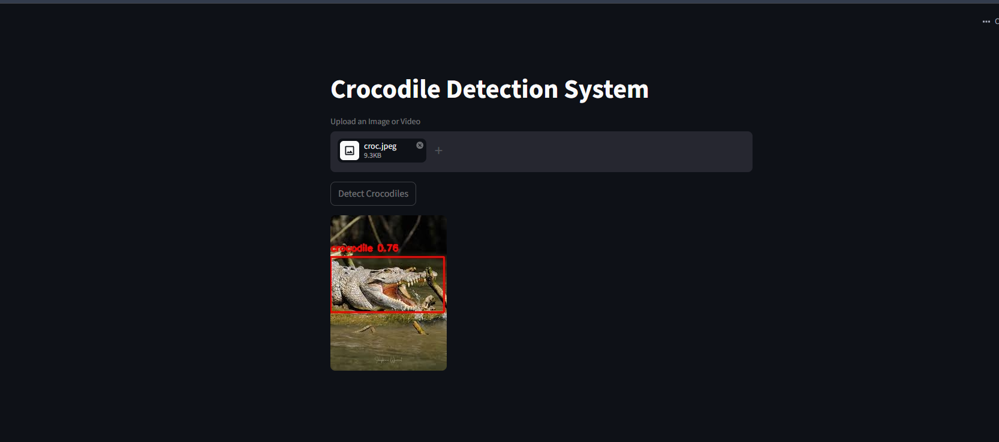

# Crocodile Detection System

Real-time saltwater crocodile detection in images and video, built on a fine-tuned YOLOv8 model. Upload footage through a web interface and get annotated frames showing where crocodiles are detected.


## Why this exists

In the Northern Territory, saltwater crocodiles are a genuine public-safety concern. Rangers and land managers monitor waterways where a missed sighting has real consequences. This project explores whether a lightweight, deployable computer-vision model can support that monitoring by flagging crocodiles in imagery automatically.

The design goal shaped every technical decision: in a safety context, a **missed crocodile is far worse than a false alarm** — but too many false alarms destroy the operator's trust in the tool. Balancing those two failure modes is the core engineering problem here, not raw accuracy.

## Features

- Detects crocodiles in both images and video, frame by frame.
- Web interface (Streamlit) for uploading footage — no code required to use it.
- Command-line mode for batch processing, with automatic snapshot saving of frames containing detections.
- Tuned to suppress false positives on visually similar subjects (other reptiles, water textures) through negative sampling during training.
- Structured logging of detection counts for later review.

## Tech stack

- **Model:** YOLOv8n (Ultralytics), fine-tuned on a custom crocodile dataset
- **Vision:** OpenCV
- **Interface:** Streamlit
- **Language:** Python 3.10+

## Setup

```bash
# 1. Clone the repository
git clone https://github.com/prabin466/Croc_Detection_System.git
cd Croc_Detection_System

# 2. Create and activate a virtual environment
python -m venv venv
source venv/bin/activate        # Windows: venv\Scripts\activate

# 3. Install dependencies
pip install -r requirements.txt

# 4. Download the trained model (not stored in git — see "Model" below)
python download_model.py
```

## Usage

### Web interface (recommended)

```bash
streamlit run app.py
```

Open the local URL Streamlit prints, upload an image or video, and click **Detect Crocodiles**. Detected frames are displayed with bounding boxes drawn around each crocodile.

### Command line

```bash
python main.py path/to/your/video.mp4
```

Processes the file frame by frame. Any frame containing a detection is saved as an annotated snapshot to the `snapshots/` directory, and a summary of detection counts is logged.



## Model

The trained weights (`croc_yolov8n.pt`, ~6 MB) are **not stored in git**. Large binary files bloat a repository's history permanently, so the model is published as a [GitHub Release](https://github.com/prabin466/Croc_Detection_System/releases) asset and fetched by `download_model.py`.

### Training approach and results

The model was fine-tuned from YOLOv8n on a ~700-image crocodile dataset. Early versions detected crocodiles well but produced frequent false positives on other reptiles and on water textures — unacceptable for a tool meant to be trusted in the field.

To address this, roughly 56 negative (background / confuser) images were added to the training set — other reptiles and crocodile-free scenes — teaching the model what a crocodile is *not*.

| Metric | Before negative sampling | After |
|---|---|---|
| mAP@0.5 | ~0.78 | ~0.678 |
| False positives (sample video) | 231 | 0 |

The drop in mAP is a **deliberate trade-off, not a regression.** Adding hard negatives made the model more conservative, which slightly lowered its overall detection score but eliminated false positives entirely on the test footage while preserving real crocodile detections. For a safety-oriented tool, an operator who trusts the alerts is worth more than a marginally higher accuracy number.

For the same reason, the **F2 score** is a more appropriate evaluation metric than F1 here, since F2 weights recall (not missing real crocodiles) more heavily than precision.

## Project structure

```
Croc_Detection_System/
├── app.py                  # Streamlit web interface
├── main.py                 # Command-line entry point
├── download_model.py       # Fetches trained weights from the GitHub Release
├── requirements.txt
├── croc_detector/          # Core package
│   ├── config.py           # Paths, model name, thresholds
│   ├── detector.py         # Model loading and inference
│   ├── frame_processor.py  # Frame extraction from images/video
│   ├── pipeline.py         # Ties processing and detection together
│   ├── annotator.py        # Draws bounding boxes on frames
│   └── logger_config.py    # Logging setup
├── training/
│   └── train.py            # Training script
└── models/                 # Trained weights land here after download
```

## Limitations and future work

- Trained on a relatively small dataset (~700 images); performance on unseen environments, lighting, and camera angles is not yet validated.
- `main.py` currently expects a file path argument and does not yet handle missing or invalid input gracefully.
- No live camera / stream input yet — processing is on uploaded files only.
- Evaluation is based on a single sample video; a larger, held-out test set would give more reliable metrics.

## Acknowledgements

Dataset assembled from public sources via Roboflow, with negative samples drawn from Open Images. Built as a portfolio project focused on a real Northern Territory problem.
