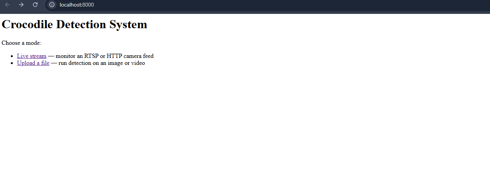
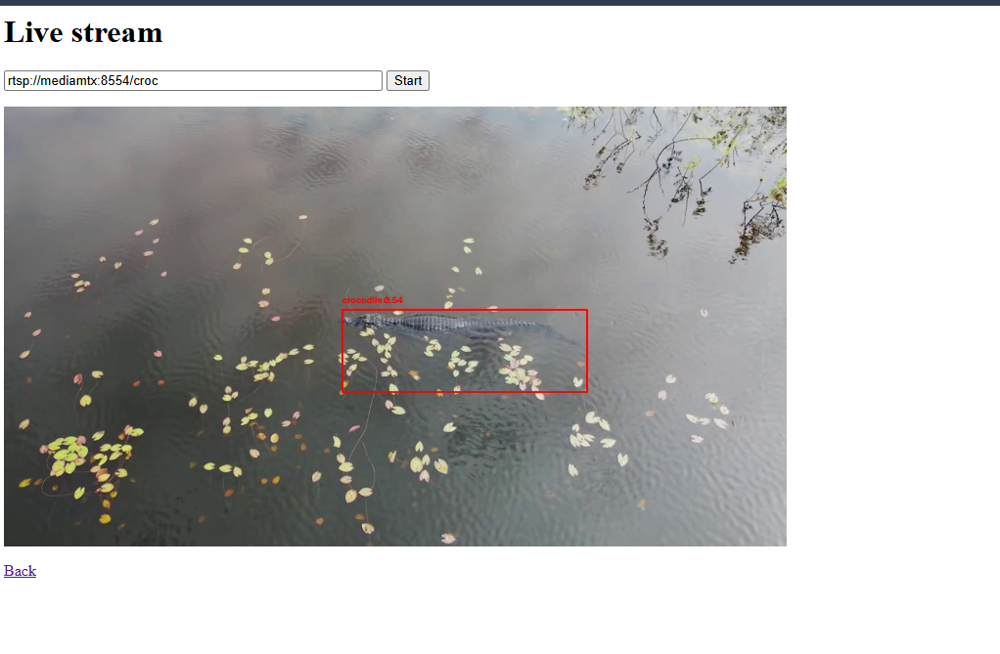

# Crocodile Detection System

[](https://github.com/prabin466/Croc_Detection_System/actions/workflows/ci.yml)


Real-time saltwater crocodile detection in images, video, and live camera streams, built on a fine-tuned YOLOv8 model. Connect an RTSP or HTTP feed for continuous monitoring, or upload footage through a web interface to get annotated frames showing where crocodiles are detected.


## Table of contents

- [Why this exists](#why-this-exists)
- [Features](#features)
- [Tech stack](#tech-stack)
- [Quick start (Docker)](#quick-start-docker)
- [Architecture](#architecture)
- [Manual setup](#manual-setup)
- [Configuration](#configuration)
- [API endpoints](#api-endpoints)
- [Model](#model)
- [Development](#development)
- [Project structure](#project-structure)
- [Limitations and future work](#limitations-and-future-work)
- [Acknowledgements](#acknowledgements)

## Why this exists

In the Northern Territory, saltwater crocodiles are a genuine public-safety concern. Rangers and land managers monitor waterways where a missed sighting has real consequences. This project explores whether a lightweight, deployable computer-vision model can support that monitoring by flagging crocodiles in imagery automatically.

The design goal shaped every technical decision: in a safety context, a **missed crocodile is far worse than a false alarm** — but too many false alarms destroy the operator's trust in the tool. Balancing those two failure modes is the core engineering problem here, not raw accuracy.

## Features

- Detects crocodiles in images and video, frame by frame.
- **Live stream monitoring** — connects to RTSP or HTTP camera feeds and serves annotated frames in real time as an MJPEG stream viewable in any browser.
- **Resilient stream handling** — threaded frame buffer, automatic reconnection with exponential backoff, and health endpoints for monitoring stream state.
- Web interface (Streamlit) for uploading footage — no code required to use it.
- Command-line mode for batch processing, with automatic snapshot saving of frames that contain detections.
- Source validation guards against SSRF, rejecting non-public addresses unless explicitly permitted.
- Tuned to suppress false positives on visually similar subjects (other reptiles, water textures) through negative sampling during training.
- Structured logging of detection counts for later review.

## Tech stack

| Layer | Technology |
|---|---|
| Model | YOLOv8n (Ultralytics), fine-tuned on a custom crocodile dataset |
| Vision | OpenCV |
| Streaming | FastAPI + MJPEG over `multipart/x-mixed-replace` |
| RTSP relay (demo) | MediaMTX, ffmpeg |
| Web interface | Streamlit |
| Deployment | Docker Compose |
| Language | Python 3.10+ |

## Quick start (Docker)

The fastest way to see the system running end to end. Requires only Docker.

```bash
git clone https://github.com/prabin466/Croc_Detection_System.git
cd Croc_Detection_System
docker compose up
```

Then open **http://localhost:8000**.





This starts four services: a MediaMTX RTSP server, an ffmpeg process looping the bundled demo clip into it, the FastAPI detection server, and the Streamlit upload interface. The live stream source is pre-filled with the demo feed, so detection on a live camera works immediately — no hardware required.

## Architecture

Four services, deliberately separated:

| Service | Role |
|---|---|
| `mediamtx` | RTSP server — **demo only**, stands in for a drone or CCTV feed |
| `ffmpeg` | **Demo only** — loops the bundled clip into MediaMTX so the demo needs no camera |
| `api` | FastAPI — detection, annotation, and MJPEG serving |
| `streamlit` | Upload interface for images and video files |

MediaMTX and ffmpeg exist purely to make the demo self-contained. In a real deployment neither is needed — the detection server connects directly to whatever RTSP or HTTP source a drone or fixed camera provides.

The detection package (`croc_detector/`) is intentionally decoupled from the web layer. The same code drives the CLI, the Streamlit app, and the streaming server — which is why adding live streaming required no changes to the detector, annotator, or pipeline.

Streaming works because MJPEG is a sequence of JPEG frames sent over one long-lived HTTP response. The browser holds the connection open and repaints on each frame, so no client-side video handling is needed. Streamlit reruns its script top to bottom on every interaction and cannot hold a generator open, which is why the stream is served by FastAPI rather than embedded in the Streamlit app.

All runtime configuration is environment-driven — stream source, Streamlit URL, and whether private addresses are permitted — so the same image runs locally, in Compose, and against real cameras without code changes.

## Manual setup

```bash
# Clone the repository
git clone https://github.com/prabin466/Croc_Detection_System.git
cd Croc_Detection_System

# Create and activate a virtual environment
python -m venv venv
source venv/bin/activate        # Windows: venv\Scripts\activate

# Install dependencies
pip install -r requirements.txt

# Download the trained model (not stored in git — see Model below)
python download_model.py
```

### Web interface

```bash
streamlit run app.py
```

Open the local URL Streamlit prints, upload an image or video, and click **Detect Crocodiles**. Detected frames are displayed with bounding boxes and confidence scores drawn around each crocodile.

### Live stream server

```bash
uvicorn server:app --host 0.0.0.0 --port 8000
```

Open `http://localhost:8000/live` and enter an RTSP or HTTP stream URL. To point at a source on your own machine, set `ALLOW_LOCAL_SOURCES=true` — private and loopback addresses are rejected by default as a SSRF guard.

### Command line

```bash
python main.py path/to/your/video.mp4
```

Processes the file frame by frame. Any frame containing a detection is saved as an annotated snapshot to `snapshots/`, and a summary of detection counts is logged on completion.


## Configuration

All settings are read from environment variables at startup.

| Variable | Default | Purpose |
|---|---|---|
| `ALLOW_LOCAL_SOURCES` | `false` | Permit private/loopback stream addresses (needed when the camera is on the same host) |
| `DEFAULT_STREAM_SOURCE` | *(empty)* | Pre-fills the source field on `/live` |
| `STREAMLIT_URL` | `http://localhost:8501` | Target for the upload link on the landing page |

## API endpoints

| Endpoint | Method | Purpose |
|---|---|---|
| `/` | GET | Landing page — choose live stream or file upload |
| `/live` | GET | Stream viewer with source input |
| `/stream?path=<url>` | GET | Annotated MJPEG stream |
| `/health` | GET | Liveness check |
| `/stream/status` | GET | Stream state, frame ID, and age of last frame |

## Model

The trained weights (`croc_yolov8n.pt`, ~6 MB) are **not stored in git**. Large binary files bloat a repository's history permanently, so the model is published as a [GitHub Release](https://github.com/prabin466/Croc_Detection_System/releases) asset and fetched automatically by `download_model.py`, which also runs during the Docker build.

### Training approach and results

The model was fine-tuned from YOLOv8n on a ~700-image crocodile dataset. Early versions detected crocodiles well but produced frequent false positives on other reptiles and on water textures — unacceptable for a tool meant to be trusted in the field.

To address this, roughly 56 negative (hard-negative / confuser) images were added — other reptiles and crocodile-free water scenes — teaching the model what a crocodile is *not*.

| Metric | Before negative sampling | After |
|---|---|---|
| mAP@0.5 | ~0.78 | ~0.678 |
| False positives (sample video) | 231 | 0 |

The drop in mAP is a **deliberate trade-off, not a regression.** Adding hard negatives made the model more conservative, which slightly lowered its aggregate detection score but eliminated false positives entirely on the test footage while preserving every real crocodile detection. For a safety-oriented tool, an operator who trusts the alerts is worth more than a marginally higher benchmark number.

For the same reason, the **F2 score** is a more appropriate evaluation metric than F1 here, since F2 weights recall (not missing real crocodiles) more heavily than precision.

To retrain on your own dataset, edit `dataset_combined/data.yaml` to point at your images and run:

```bash
python training/train.py
```

## Development

### Install dev dependencies

```bash
pip install -r requirements-dev.txt
```

### Run tests

```bash
pytest tests/ -v
```

Tests cover extractor routing, stream deduplication, source URL validation (SSRF guards), and annotator output shape — all without requiring the model weights or a live camera.

### Lint

```bash
ruff check croc_detector/ tests/
```

CI runs both on every push and pull request to `main`.

## Project structure

```
Croc_Detection_System/
├── server.py               # FastAPI — landing page, live viewer, MJPEG stream
├── app.py                  # Streamlit upload interface
├── main.py                 # Command-line entry point
├── download_model.py       # Fetches trained weights from the GitHub Release
├── Dockerfile
├── docker-compose.yml      # Four-service demo stack
├── requirements.txt
├── requirements-dev.txt
├── croc_detector/          # Core detection package
│   ├── config.py           # Paths, thresholds, env-driven settings
│   ├── detector.py         # Model loading and YOLO inference
│   ├── frame_processor.py  # Frame extraction from images, video, and live streams
│   ├── pipeline.py         # Wires the extractor and detector together
│   ├── annotator.py        # Draws bounding boxes on frames
│   ├── validation.py       # Source URL validation / SSRF guard
│   └── logger_config.py    # Structured logging setup
├── tests/
├── training/
│   └── train.py            # Fine-tuning script
├── tools/                  # Local MediaMTX binary and config for manual RTSP testing
├── dataset_combined/       # YOLOv8 dataset (images not in git)
└── models/                 # Trained weights land here after download
```

## Limitations and future work

- Trained on a relatively small dataset (~700 images). Performance on unseen environments, lighting, and camera angles is not yet validated; confident false positives on visually similar subjects outside the tested confuser set are still possible. Expanding the negative sample set is the highest-value next step.
- Evaluation is based on a single sample video; a larger held-out test set would give more reliable metrics.
- Source validation resolves a hostname and checks the resulting IP, but OpenCV resolves independently when connecting — a narrow time-of-check-to-time-of-use window remains.
- Single-stream architecture. Supporting concurrent sources would require a stream registry keyed by source URL.
- Inference runs on CPU in the container. GPU acceleration would require a CUDA base image and the `nvidia-container-toolkit`.

## Acknowledgements

Dataset assembled from public sources via Roboflow, with negative samples drawn from Open Images. Built as a portfolio project focused on a real Northern Territory problem.
